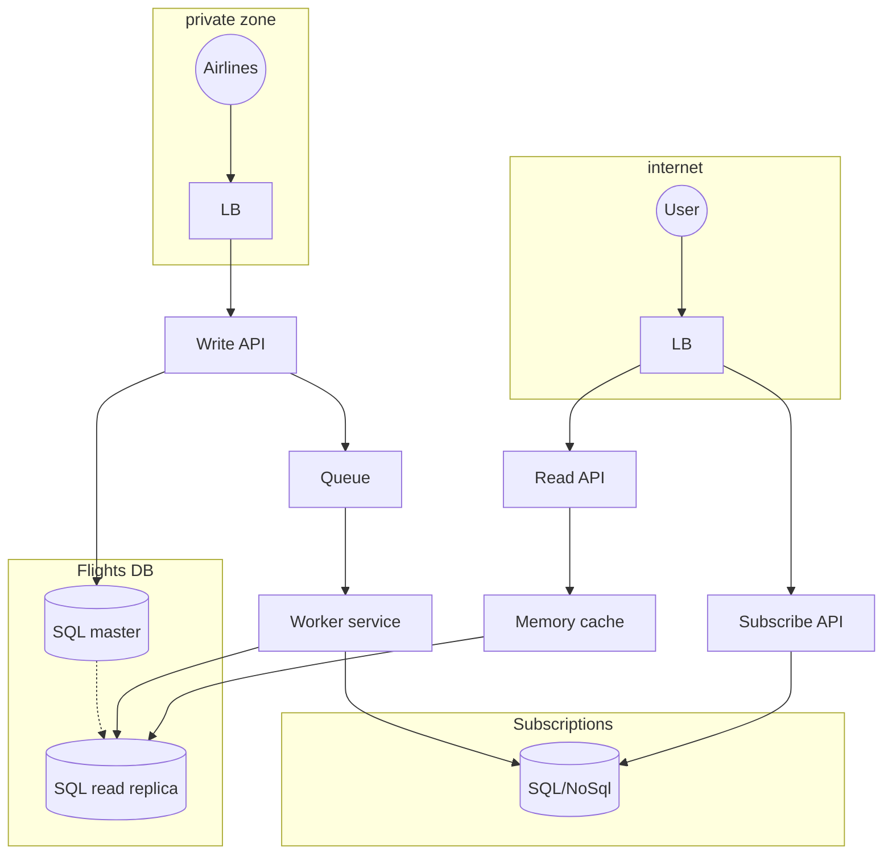
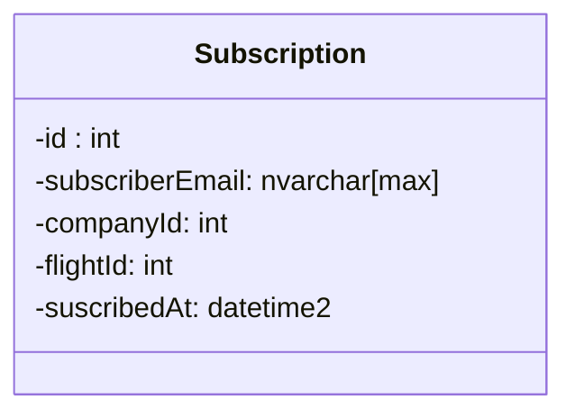
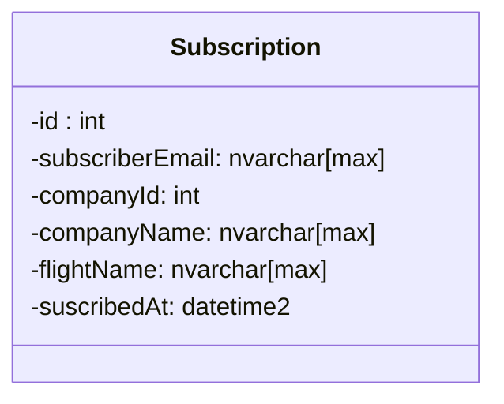
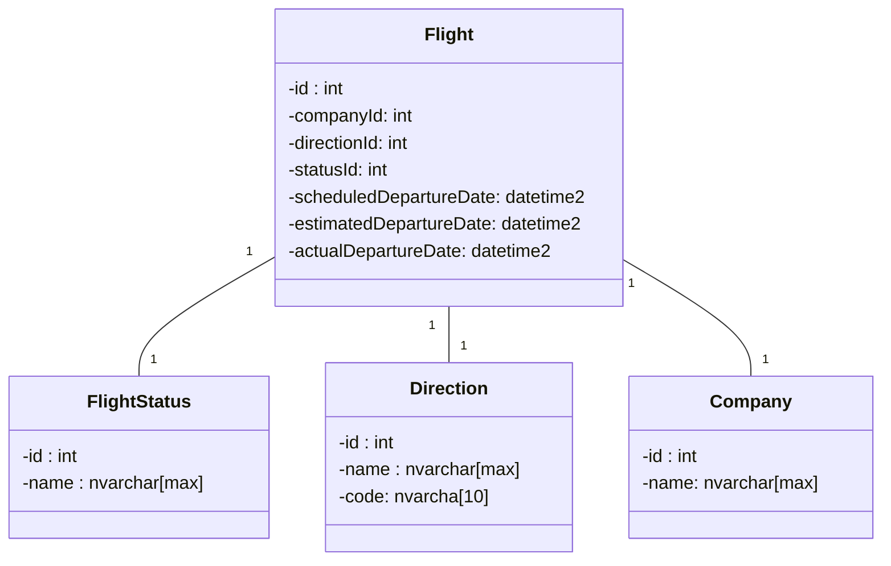

# Solution design problem - Flight information display system

## The task is to design a system that meets the following requirements:
1. For this exercise, we’ll consider ONLY departing flights (not arrivals as well)
2. There is a flight schedule, which defines when the regularly scheduled flights occur.
For example: Air New Zealand has a flight NZ0128 that flies to Melbourne (MEL) at
6:30am on Monday, Wednesday and Friday.
3. The airlines keep the schedule up to date when they make schedule changes
4. The flight display has a list of upcoming departures
5. Each flight has the following properties
    - An Airline name
    - Flight number
    - destination
    - Schedule departure time
    - Estimated departure time
    - Actual departure time
    - Flight status, which is one of:
      - On time
      - Check in
      - Boarding
      - Departed
      - Cancelled
      - Delayed
6. The big ticker board in the airports will get the information from your system over a
Web API
7. The flight information needs to be viewable over the internet (so people can check
their flight status before coming to the airport)
8. The internet accessible view of flight information must deal with large traffic spikes for
when a storm or other event means that a lot of people are checking flight status at the
same time
9. Passengers can subscribe to a particular flight and receive push notifications when its
status or details change

## Proposed implementation:
### System diagram


### Components

### Private API (write)
To handle write requests from the airlines, I would add an API service. This service will handle only write requests. The service should not be accessible from
the internet - so, I would add a restriction at the infrastructure layer (list of allowed APIs, allowed VPNs, the rest traffic is blocked).
The API itself should be secured and implement some authorization/authentication to identify airline/allowed scopes.

The API will write the data into the master DB and if required send notification to a queue.

Proposed tech stack:
  - .Net Core 6.x - the latest version of well-known framework, which can demonstrate great performance
  - .Net Core WebApi - a library by Microsoft, to provide a nice way of creating web APIs. It supports versioning, throttlingg and some other cool features out of box.
  
Proposed API endpoints implementation:

```
[POST] - https://xyz.com/api/private/v1/company/{id}/flight - adds a new flight to the system
[PATCH] - https://xyz.com/api/private/v1/company/{id}/flight/{id} - updates some information of the flight (status and times)
```

### Public API (reads)
This component will handle read requests from clients and will be available from the internet.

Proposed tech stack is the same as for Private API.

Proposed API endpoint implementation:

```
[GET] - https://xyz.com/api/private/v1/flight?pageNum=1&pageSize=20 - returns information about flights. The information is paginated and does not contain historical data.
```

### Public API (subscribes to flight updates)
This component will let clients subscribe to flight updates, which will be available from the internet.

Proposed tech stack is the same as for Private API.

Proposed API endpoint implementation:

```
[POST] - https://xyz.com/api/private/v1/flight/{id}/subscribe - subscribes to the flight updates.
```

### Memory cache
To deal with peak load, I would use memory cache. The cache will contain information for the most frequently viewed flights to the most popular directions.
If the requested information does not exist in the cache, the system will go down to the read-replica DB.

Proposed tech stack:
  - Redis or Memcached. Both of them have good performance. I would personally go with Redis since it is more popular nowadays.

### Queue
When the flight is updated, the system will post a message into the queue component. It will let us have scalability and process a lot of flight updates.

Proposed tech stack:
  - Azure service bus queue (or topic if required)

Proposed message format:
```
{
  "corellationId": GUID,
  "airlineId": int,
  "flightId": int,
  "timestamp": epoch time stamp, int
  "status": int
}
```

### Worker service
A service that will react to a new message in the queue component. In the current scenario, it will:
  - receive message that a flight was changed
  - get users to notify about the change
  - get details of the flight
  - notify users
  
Proposed tech stack:
  - Azure functions to proceed the logic
  - A logic app or a durable function to orchestrate the functions


#### Subscriptions DB
This DB will store information about subscribed users and which flight that would like to track. We can use SQL or NoSQL DB. I would start with the easiest option - SQL.
If the DB becomes a bottle neck, I would switch to a NoSQL DB which can scale up and handle large read requests.

Proposed tech stack:
  - Azure Sql server or Azure CosmosDb
  


In order to optimize performance and if company name/flight name cannot be changed - we can store more information in the table. In this case
to notify user the system is unlikely to have to gather other information, and consequently the performance might be better



#### Flights DB
I think the system will need to handle more read requests rather than write one. In this case, I would use two databases:
  - the master DB, that will process writes
  - a read-only replica, that will handle the read traffic
In this way, during spikes and the peaks, the system will be able to continue accepting writes and process read requests. However, the DBs might be out of sync
for some period of time (the replica might miss some updates from the master).

Proposed tech stack:
  - Azure Sql server
  
Proposed schema:


## Scalability
I think, to develop a scalable system, we would need to have a few instances of our components (APIs, queue, worker, cache). To route the traffic, some load balancers
will be required. Having one load balancer per connection might not be enough since it can come a single point of failure. More work needs to be done in this area.

If SQL databases are bottle neck - I would try:
  - use more master/read-only replicas
  - consider switching to a NoSQL
  
I would use logs, monitoring tools, load tests to identify the bottlenecks and address them one by one.

## Testing
- Unit tests for api/workers components (logic only, small pieces of the functionality, no real dependencies to other modules)
- Integration tests for api/workers components to see how those components work by themselves
- End2End tests to verify the whole flow
- Load tests to measure performance

## Estimations
I assume 1-3 developers will be required, as well as 1-2 QAs and a DevOps engineer. Depending on their productivity, I would expect around 2 months to implement
the proposed solution (including automation, ci/cd, multi staging environments testing). Developer/s might balance and help DevOps if there is a need/chance.

## Tradeoffs
1. In order to handle spices, we will have to have more than 1 instance of each/most of the components - it will increase the complexity of the project and the
budget
2. Stale data might temporarily exist in read-only DB/notifications DB
3. In case of using NoSQL Dbs - the curve of jumping into the project might increase
4. Memory cache might not contain enough information and might become slow

## TODO
- DevOps
- Automation
- More estimations
- Component/s to clean up Notifications DB
- Resiliency
- Handling repeatable messages (at-lest-once-delivery tradeoff), out of order messages (multiple updates for the same flight within a short period of time)

